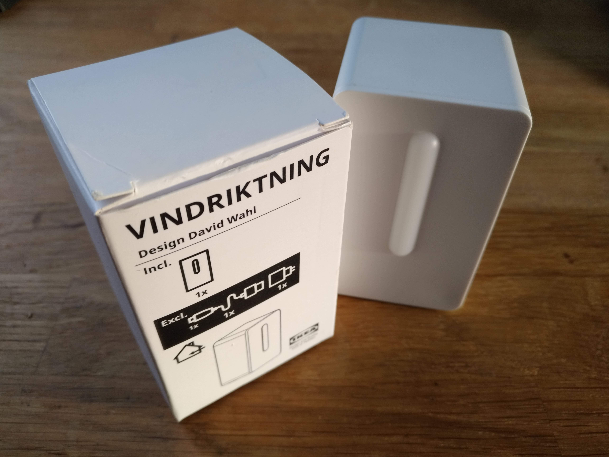
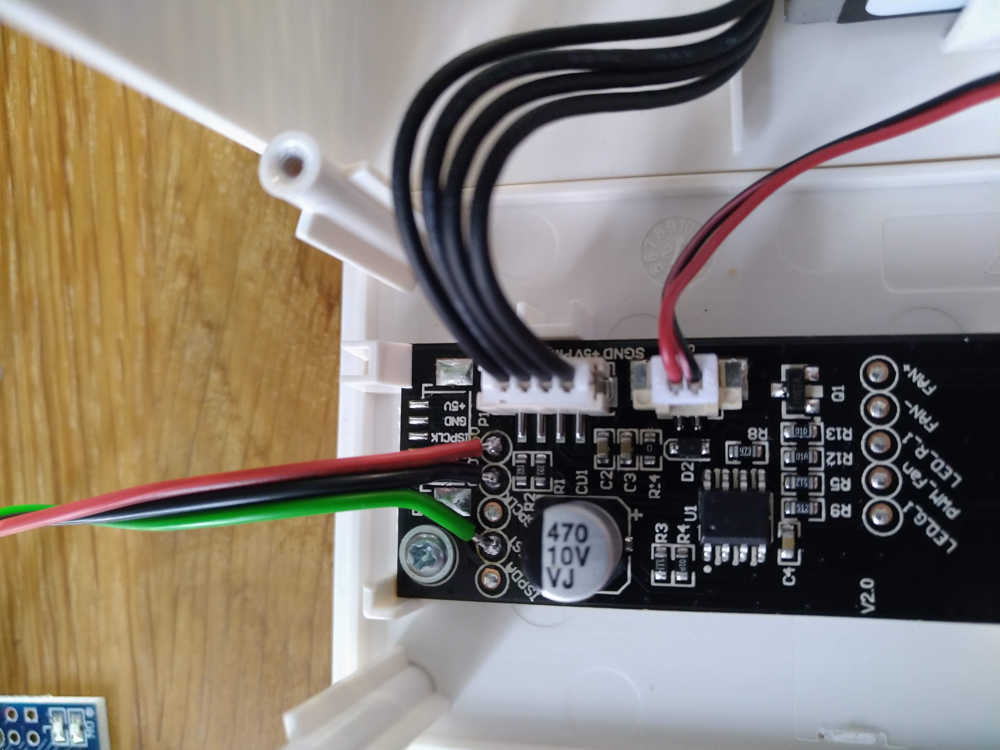
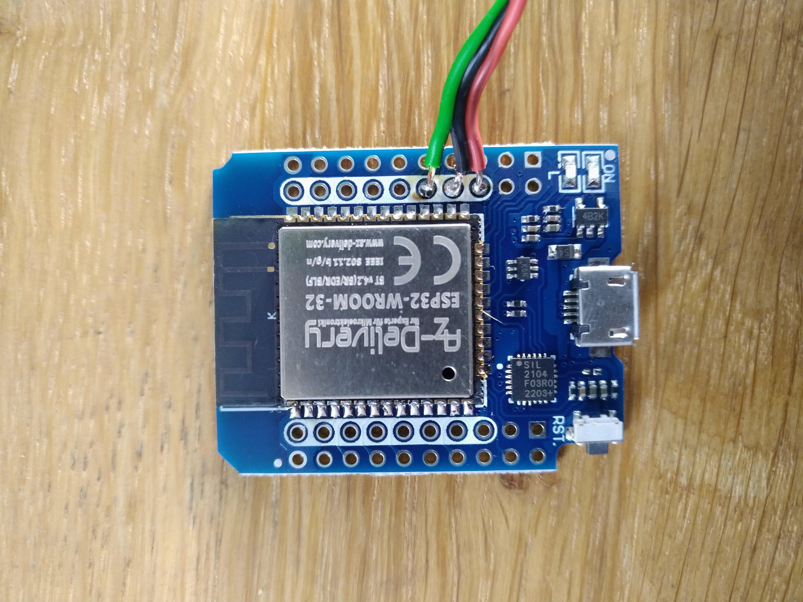
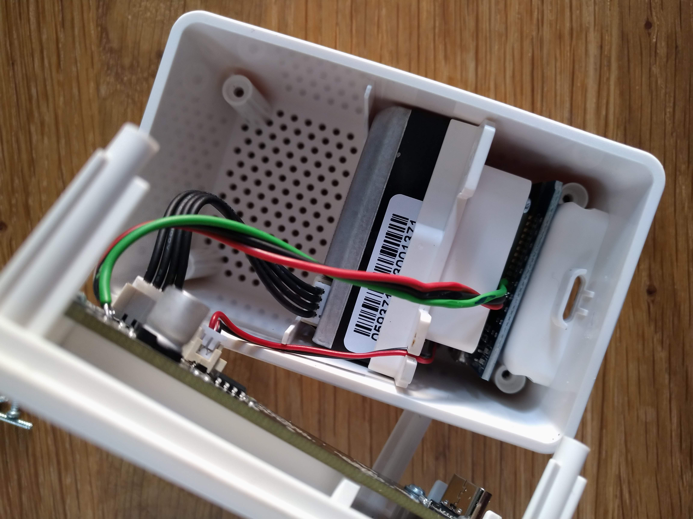

<p align="center">

&nbsp;

&nbsp;
<a href="https://www.buymeacoffee.com/sharandac" target="_blank"></a>
</p>
<hr/>

# Vindriktning

Let's make the Ikea Vindriktning air quality sensor a little smarter. Here is the matching completely over-engineered firmware.

## prerequisite

ESP32 - Mini D1<br>
Ikea Vindriktning

# Install

Clone this repository and open it with platformIO. Remember, the SPIFF must also be flashed. On a terminal in vscode you can do it with
```bash
pio run -t uploadfs
pio run -t upload
```

After that, take a look at your monitorport ...

```text
[I][vindriktning.cpp:65] vindriktning_Task(): Start Vindriktning Task on Core: 1
[I][wificlient.cpp:91] wificlient_Task(): Start Wifi-Client on Core: 1
[I][wificlient.cpp:108] wificlient_Task(): WiFi connection lost, restart ... 
[I][wificlient.cpp:398] wificlient_start_softAP(): starting Wifi-AP with SSID "vindriktning_d1fd28" / "vindriktning"
[I][wificlient.cpp:399] wificlient_start_softAP(): AP IP address: 192.168.4.1
[I][webserver.cpp:56] asyncwebserver_Task(): Start Webserver on Core: 1
[I][ntp.cpp:65] ntp_Task(): Start NTP Task on Core: 1
[I][mqttclient.cpp:320] mqtt_client_Task(): Start MQTT-Client on Core: 1
[I][callback.cpp:31] callback_print():  |
[I][callback.cpp:32] callback_print():  +--'mqtt client' ( 0x3ffb97a8 / 1 )
[I][callback.cpp:34] callback_print():  |  +--id:'vindriktning', event mask:0001, prio: 2, active: true
[I][callback.cpp:31] callback_print():  |
[I][callback.cpp:32] callback_print():  +--'webserver' ( 0x3ffb97fc / 7 )
[I][callback.cpp:34] callback_print():  |  +--id:'/vindriktning.htm', event mask:001f, prio: 2, active: true
[I][callback.cpp:34] callback_print():  |  +--id:'/index.htm', event mask:0007, prio: 1, active: true
[I][callback.cpp:34] callback_print():  |  +--id:'/wlan.htm', event mask:001f, prio: 3, active: true
[I][callback.cpp:34] callback_print():  |  +--id:'/update.htm', event mask:0007, prio: 3, active: true
[I][callback.cpp:34] callback_print():  |  +--id:'/info.htm', event mask:0007, prio: 3, active: true
[I][callback.cpp:34] callback_print():  |  +--id:'/mqttclient.htm', event mask:001f, prio: 2, active: true
[I][callback.cpp:34] callback_print():  |  +--id:'/ntp.htm', event mask:001f, prio: 2, active: true
```
When the output look like this, congratulation!

After the first start an access point will be opened with an unique name like
```bash
vindriktning_XXXXX
```
and an not so unique password
```bash
vindriktning
```
After that you can configure the vindriktning under the following IP-address with your favorite webbrowser
```bash
http://192.168.4.1
```

## hardware modification in 4 steps

esp32 -> Vindriktning:<br><br>
VCC -> +5V<br>
GND -> GND<br>
GPIO16 -> reset<br>






# Contributors

Every Contribution to this repository is highly welcome! Don't fear to create pull requests which enhance or fix the project, you are going to help everybody.
<p>
If you want to donate to the author then you can buy me a coffee.
<br/><br/>
<a href="https://www.buymeacoffee.com/sharandac" target="_blank"></a>
</p>
